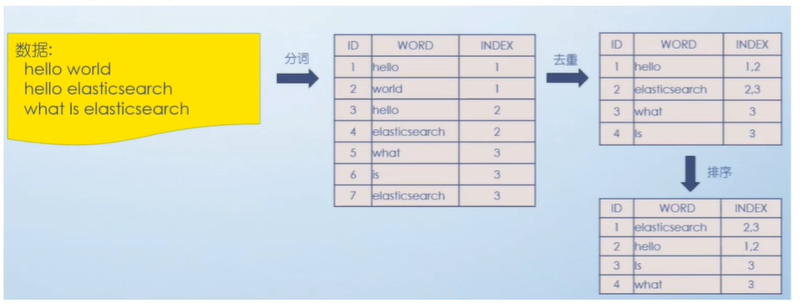

# ES

## ES的写入和查询的流程是怎么样的？

- 写入
    1. 客户端发送写数据的请求时，可以发往任意节点，这个节点就会成为协调节点
    2. 通过进行hash取模运算来确定数据落入哪个分片中
    3. 协调节点就会将请求路由给 主分片所在的节点中
    4. 数据节点处理请求，将数据写入到索引库，并且将数据同步到对应的副本中
    5. 等主节点和备份节点都保存好文档之后，返回客户端响应
- 查询
    1. 客户端发送查询请求，可以发往任意节点，这个节点就会成为协调节点
    2. 协调节点将查询请求广播到每一个数据节点，这些数据节点的分片就会处理查询请求
    3. 每个分片将查询出来符合条件的数据放到一个队列中，并将这些数据的文档ID、节点信息、分片信息都返回给协调节点
    4. 由协调节点将所有的结果进行汇总，并排序
    5. 协调节点向包含这些文档ID的分片发送get请求，对应的分片将文档的数据返回给协调节点，最终协调节点将数据整合返回给客户端。

## ES倒排索引

1. 倒排索引建立的大致流程如下
2. 先对数据分词，然后创建分词结果与文档ID的映射
3. 对分词到ID的映射进行去重，形成关键词 -> ids 的一种结构
4. 当我们查询的时候，对查询条件分词，然后通过分词找到对应的文档id，
5. 再通过id去原数据表中找到对应的数据