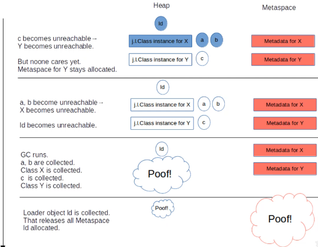
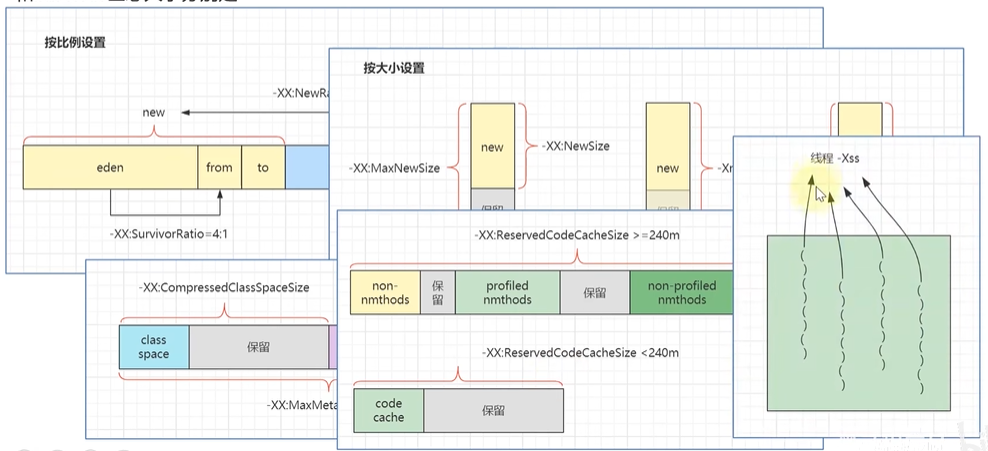
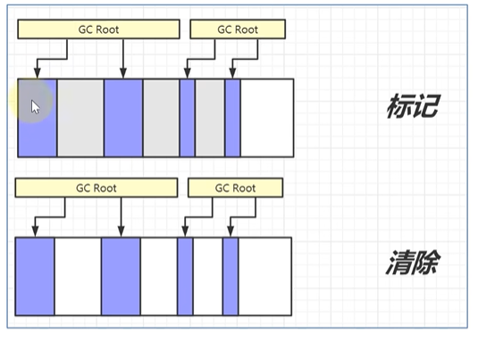
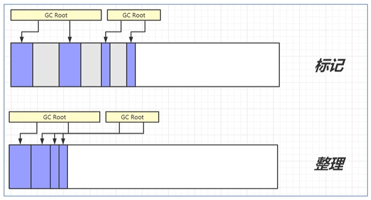
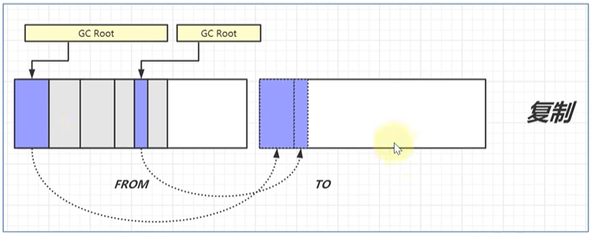
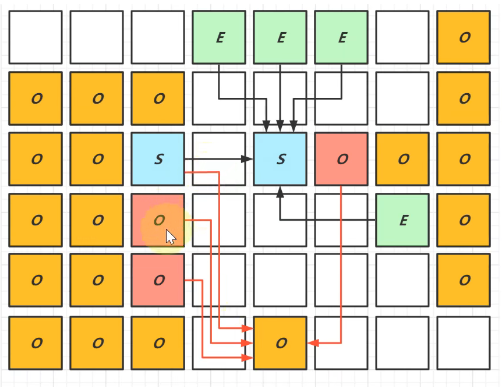

# JVM

## jvm的内存结构

- 线程私有
    - 程序计数器
    - 虚拟机栈
- 线程共享
    - 堆
    - 方法区
- 方法区
    - 方法区保存的都是类的元数据信息，类的名称、继承关系、类的引用等等信息
- 堆内存
    - 堆内存保存的都是java中new出来的对象
- 程序计数器
    - 程序计数器保存的是当前线程运行的代码情况，一些上下文信息，用于来线程切换的时候还原现场
- 虚拟机栈内存
    - 栈内存中保存的都是类的方法、方法的参数、对象的引用、局部变量等等信息

Java的源代码经过编译成class字节码，然后通过解释器来编译成机器码，运行在jvm虚拟机中，当某些代码运行的次数足够多就会被JIT保存为热点代码在codeCache中，一些没有被引用的对象，经过一段时间就会被GC回收掉。

## jvm内存中哪些部分会出现内存溢出？

首先说明不会出现内存溢出的区域是 **程序计数器**

- 出现 OutOfMemoryError的情况
    - 堆内存耗尽- 对象越来越多，又一直在使用，不能被垃圾回收
    - 方法区内存耗尽- 加载的类越来越多，很多框架都会在运行期间动态产生新的类
    - 虚拟机栈累积- 每个线程最多会占用 1M 内存，线程个数越来越多，而又长时间运行不销毁时
- 出现 StackOverFlowError的情况
    - 虚拟机栈内部 - 方法调用次数过多 - 递归

## 方法区与永久代、元空间之间的关系

- 方法区是JVM规范中定义的一块内存区域，用来存储类的元数据、方法字节码、即时编译器需要的信息等
- 永久代是 HotSpot 虚拟机对 JVM 规范的实现 **1.8 之前**
- 元空间是 HotSpot 虚拟机对 JVM 规范的实现 **1.8之后** ，使用本地内存作为这些信息的存储空间

1. 如上图，加载 X 类，会把类的相关信息存储元空间
2. new X 类的对象 会把内存存储在 堆 内存区域，默认也会把X类的.Class 信息存入堆空间
3. 同理，加载 Y 类，会把 Y 类的相关信息存储在元空间，new 的 Y 类对象会存储在 堆空间
4. 当 这些对象都没有被使用的时候，GC 就会把这些对象从 堆中清理掉
5. 当 这个类产生的所有对象都没有被使用的时候，才会把 类的加载信息 从 元空间中卸载掉

## jvm参数

- -Xmx1024m：代表jvm占用最大内存
- -Xms1024m：代表jmv占用最小内存
- -Xmn512m：代表新生代占用的内存
- -XX:SurvivorRatio=3：代表新生代中伊甸园区与存活区的所占比例（新生代）
- -XX:ReservedCodeCacheSize=240m：代表JIT热点代码缓存区所占大小，当小于240的时候所有代码存在一个区，当大于240的时候会内缓存区划分，分成未优化代码，部分优化代码，完全优化代码来存储

## jvm垃圾回收算法

- 标记清除

1. 标记清除法就是在堆中找到一个GC根对象，然后顺着引用去打标记，被标记的对象视为常用对象，在GC的时候不会被清除掉
2. 标记清楚法会导致内存碎片的问题

- 标记整理

1. 标记整理法第一步也是先对引用对象打上标记然后清除无用的对象
2. 在清除之后，把引用的对象整理起来，让内存连续使用，保证了内存的使用率

- 标记复制

1. 标记复制与上边两个不同点就是，先在内存中开辟两块空间
2. 当第一个空间需要进行GC的时候对引用对象打上标签
3. 然后把打标签的对象复制到另一块内存，之后把老的那块内存全部清理掉
4. 优点就是不会产生内存碎片，复制的效率要高于移动，缺点就是需要占用两块内存

## GC概述

- GC的目的在于实现无用对象内存自动释放、减少内存碎片、加快分配速度
- GC的重点
    - 回收区域是**堆内存**，不包括虚拟机栈，因为虚拟机栈在方法调用结束会自动释放方法占用的内存
    - 判断无用对象，使用**可达性分析算法**，**三色标记法**标记存活对象，回收未标记对象
    - GC具体的实现称为**垃圾回收器**
    - GC大都采用了**分代回收思想**，理论依据是大部分对象朝生夕灭，用完立刻就可以回收，另有少部分对象会长时间存活，每次很难回收，根据这两类对象的特性将回收区域分为**新生代**和**老年代**，不同区域应用不同的回收策略
    - 根据GC的规模可以分为 **Minor GC**，**Mixed GC（G1独有）**，**Full GC**

## 分代回收与GC规模

- 分代回收
    - **伊甸园 eden 区**是最初对象都分配到这里，与**幸存区**合成**新生代**
    - **幸存区** survivor，当伊甸园区内存不足，回收后的幸存对象到这里，分为 from 和 to，采用标记复制算法，每次回收之后，from和to会交换位置
    - **老年代** old，当幸存区对象熬过几次回收（最多15次），晋升为老年代（幸存区内存不足或大对象会导致提前晋升）
- GC的规模
    - Minor GC 发生在新生代的垃圾回收，暂停时间短
    - Mixed GC 新生代+老年代部分区域的垃圾回收，G1收集器特有
    - Full GC 新生代+老年代完整垃圾回收，暂停时间长，应尽力避免

## 三色标记与并发漏标问题

- 用三种颜色记录对象的标记状态
    - 黑色-已标记
    - 灰色-标记中
    - 白色-还未标记
- 漏标问题-记录标记过程中变化
    - 漏标问题是在垃圾回收线程标记过程中，用户线程改变了对象的引用状态导致对象标记状态漏标
    - Incremental Update ：只要赋值发生，被赋值的对象就会被记录
    - SATB：新加对象被记录，被删除引用关系的对象也被记录
    - 记录之后，暂停用户线程，针对记录变化的对象重新标记

## 垃圾回收器

- Parallel GC
    - 伊甸园区内存不足发生 Minor GC，标记复制 STW
    - 老年代内存不足发生 Full GC ，标记整理 STW
    - 注重**吞吐量**
- ConcurrentMarkSweep GC
    - 老年代 **并发标记**，重新标记时需要STW,**并发清除**
    - Failback Full GC
    - **注重响应时间**
- G1 GC
    - 响应时间与吞吐量兼顾
    - **划分为多个区域，每个区域都可以充当伊甸园区、幸存区、老年代、大对象区**
    - 新生代回收：伊甸园区内存不足，标记复制 STW
    - 并发标记：老年代并发标记，重新标记时需要 STW
    - **混合收集：并发标记完成，开始混合收集，参与复制的有 伊甸园区、幸存区、老年代，其中老年代会根据 暂停时间目标，选择部分回收价值高的区域，复制时 STW**
    - Faiback Full GC：并发失败的时候，进行保底Full GC

G1呢，整体来说，是把对内存区域划分了很多小块，每个小块都会先充当 伊甸园区，当发生最小回收的时候，把幸存对象放入到 幸存区中，当发生混合收集的时候，会把伊甸园区中要晋升的和幸存区中要晋升的都向新的内存区域放置，然后回收掉这些区域，当回收的规模较大超过了设置的回收时间时，会选择有价值的回收多的区域进行垃圾回收。在进行Full GC的时候还是需要暂停用户线程。

## 项目中什么情况下会内存溢出？怎么解决

- 误用线程池导致内存溢出
  - 使用Executors.newFixedThreadPool 创建线程池，它内部消息队列是无限大小的，所以可能会导致队列堆积，内存溢出
  - 使用Executors.newCachedThreadPool 创建线程池，它的线程数量是int最大值，也可能会无限创建线程导致内存溢出
  - 为了防止出现这种情况，我们应该视情况而定ThreadPoolExecutor自定义配置线程池的参数
- 查询数据量大太导致的内存溢出
  - 在查询数据库，或者进行数据计算的时候，尽量不要放大量的数据到内存中。
- 动态生成类导致的内存溢出
  - 定义变量的时候一定要注意static类型的变量，因为使用static类型变量就相当于root对象，不会被垃圾回收器回收掉，所以也会导致类加载信息不会从元空间被卸载，元空间也可能出现内存溢出

## 类加载过程

1. 加载
  1. 将类的字节码载入方法区，并创建类.class对象
  2. 如果此类的父类没有加载，先加载父类，接口也是
  3. 加载时懒惰执行的
2. 链接
  1. 验证-验证类是否符合Class规范、合法性、安全性检查
  2. 准备-为static 变量分配空间，设置默认值
  3. 解析-将常量池的符号引用解析为直接引用
3. 初始化
  1. 执行静态代码块与非final静态变量的赋值
  2. 初始化是懒惰执行的

## 双亲委派机制

所谓的双亲委派，就是指优先委派上级类加载器进行加载，如果上级类加载器

- 能找到这个类，由上级加载，加载后该类也对下级加载器可见
- 找不到这个类，则下级类加载器才有资格执行加载

**类加载器的等级关系 从顶向下**

1. Bootstrap ClassLoader  启动类加载器，加载 JAVA_HOME/jre/lib下的类
2. Extension ClassLoader 扩展类加载器，加载JAVA_HOME_jira/lib/ext 下的类
3. Application ClassLoader 应用类加载器，加载ClassPath下边的类 也就是我们自己写的类
4. 自定义类加载器，加载自定义规则的类

**双亲委派的目的**

- 让类的加载有优先次序，保证核心类优先加载
- 让上级类加载器中的类对下级共享，能让你的类依赖到jdk提供的核心类

## 四种对象引用

- 强引用
  - 普通变量赋值即为强引用，如 A a = new A();
  - 通过 GC Root 的引用链，如果强引用不到该对象，该对象才能被回收
- 软引用
  - 例如 SoftReference a = new SoftReference(new A());
  - 如果仅有软引用该对象时，首次垃圾回收不会回收该对象，如果内存仍不足，再次回收时才会释放对象
  - 软引用自身需要配合引用队列来释放
  - 典型例子时反射数据
- 弱引用
  - 例如 WeakReference a = new WeakReference(new A());
  - 如果仅有弱引用引用该对象时，只要发生垃圾回收，就会释放该对象
  - 弱引用自身需要配合引用队列来释放
  - 典型例子时 ThreadLocalMap 中的 Entry 对象
- 虚引用
  - 例如 PhantomReference a = new PhantomReference(new A());
  - 必须配合引用队列一起使用，当虚引用引用的对象被回收时，会将虚引用对象入队，由Reference Handler 线程释放其关联的外部资源
  - 典型例子时 Cleaner 释放 DirectByteBuffer 占用的直接内存

## finalize的理解

- 它是 Object中的一个方法，子类重写它，垃圾回收时此方法会被调用，可以在其中进行一些资源的释放和清理工作
- 但是这个方法非常影响性能，严重时甚至会引起OOM，从java9中就弃用了
- 重写了finalize方法的对象都会被加入到一个队列中
- jvm中专门启动了一个finalize守护线程，去轮询这个队列，就算GC立刻标注了要清理该对象，但该对象也不会被立刻清理掉，会等守护线程调用这个对象的finalize方法之后，把这个引用从双向链表中断开引用，让GC再次清理
- finalize方法中不会抛出异常
