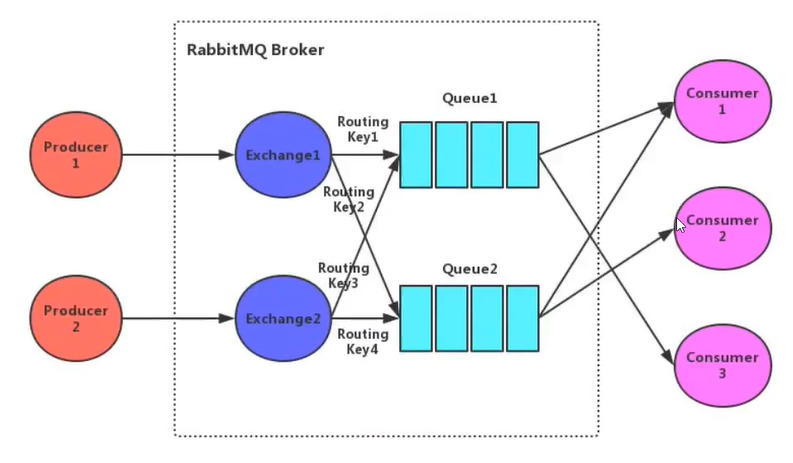
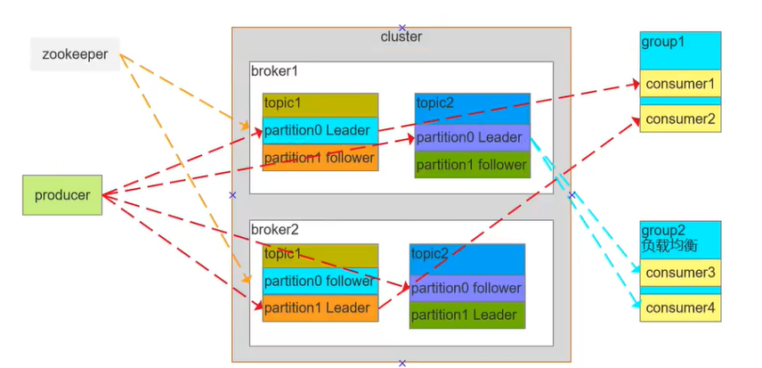

# MQ

## 如何进行产品的选型？

- Kafka
    - 优点：吞吐量非常大，性能非常好，集群高可用
    - 缺点：会丢数据，功能比较单一
    - 场景：日志分析，大数据采集
- RabbitMQ
    - 优点：消息可靠性高，功能全面
    - 缺点：吞吐量比较低，消息积累会严重影响性能，erlang语言不好定制
    - 场景：小规模场景
- RocketMQ
    - 优点：高吞吐、高性能、高可用、功能非常全面
    - 缺点：开源版本功能不如商用版，官网文档和周边生态还不够成熟。客户端只支持java
    - 场景：几乎是全场景

## 消息队列的优缺点 和使用场景

- 优点
    - 解耦，降低系统之间的依赖
    - 异步处理，不需要同步等待
    - 削峰填谷，将流量从高峰期引到低谷期进行处理
- 缺点
    - 增加了系统的复杂度，幂等、重复消费、消息丢失等问题的带入
    - 系统可用性降低，mq的故障会影响系统可用
    - 一致性，消费端可能失败
- 使用场景
    - 日志采集
    - 发布订阅

## RabbitMQ

### RabbitMQ架构

- Broker：rabbitmq的服务结点
- Queue：队列，是rabbitmq的内部对象，用于存储消息。RabbitMQ中消息只能存储在队列中。
    - 生产者投递消息到队列，消费者从队列中获取消息并消费
    - 多个消费者可以订阅同一个队列，队列中的消息会通过负载(轮询)给多个消费者进行消费，而不是每个消费者都可以收到消息。
    - rabbitmq不支持队列层面的广播消费，可以通过交换器通过路由key绑定多个队列，由多个消费者订阅这些队列的方式实现广播模式
- Exchange：交换器，生产者将消息发送到exchange，由交换器将消息路由到一个或多个队列中，如果路由不到，可以返回生产者或者丢弃或者做其他处理
- RoutingKey：路由Key，生产者将消息发送给交换器的时候，一般会指定一个RoutingKey。
    - RoutingKey来指定这个消息的路由规则。这个路由key需要与交换器类型和绑定键(BindingKey)联合使用最终才能生效。
    - 在交换器类型和绑定键固定的情况下，生产者可以在发送消息给交换器时通过指定RoutingKey来决定消息流向哪里。
- Binding：通过绑定将交换器和队列关联起来，在绑定的时候一般会指定一个绑定键，这个mq就可以指定如何正确的路由到队列了
- 信道：信道是建立在Connection之上的虚拟连接，当应用程序与Rabbit Broker建立TCP链接的时候，客户端紧接着可以创建一个AMQP信道(Channel)，每个信道都会被指派一个唯一的ID。
    - RabbitMQ中是使用TCP长连接来实现的。
    - RabbitMQ处理的每条AMQP指令都是通过信道完成的。

### RabbitMQ如何确保消息发送成功？接收成功？

- 发送方确认机制
    - 信道需要设置为 confirm 模式，表示所有在此信道上发布的消息都会分配一个唯一的ID
    - 一旦消息被投递到queue（可持久化的消息需要写入磁盘），信道就会发送一个 ack 给生产者（包含消息唯一ID）
    - 如果rabbitMQ发送内部错误从而导致消息丢失，会发送一条 nack 消息给生产者
    - 所有被发送的消息都将被 ack 或者 nack 一次。但是没有对消息被确认的快慢做任何保证，并且同一条消息不会即被ack又被nack
    - 发送方确认模式是异步的，生产者应用程序在等待确认的同时，可以继续发送消息。当确认消息到达生产者，生产者的回调方法会被触发
    - ConfirmCallback接口：消息成功时回调
    - ReturnCallBack接口：消息失败时回调
- 接收方确认机制
    - 消费者在声明队列时，可以指定 noAck 参数，当 noAck=false时，RabbitMQ会等待消费者显式返回ack信号后才从内存或者磁盘中移除消息
    - 消费者接收每一条消息后都必须进行确认，只有消费者确认了消息，rabbitmq才能安全地把消息从队列中删除
    - rabbitmq不会为 未ack的消息设置超时事件，它判断此消息是否需要重新投递给消费者的唯一依据是消费该消息的消费者连接是否断开，这么设计的原因是mq允许消费者消费一条事件很长的消息，保证该数据的最终一致性
    - 如果消费者返回ack之前断开了连接，mq会重新分发给下一个订阅的消费者，可能会存在消息重复消费的隐患，业务方要做好幂等的操作

### RabbitMQ消息的事务

- 生产者事务：通过对信道的设置实现
    1. channel.txSelect(); 通知服务器开启事务模式；服务端会返回Tx.Selet-OK
    2. channel.basicPublish; 发送消息，可以是多条，这个时候并没有真正投递到Queue中，而是放到了一个临时队列中
    3. channel.txCommit；提交事务，这个时候才会真正投递到Queue中
    4. channel.txRollback；回滚事务
- 消费者事务：关闭自动ack
    1. autoAck = false，手动提交ack，以事务提交或回滚为准
    2. autoAck = true，不支持事务，也就是说即使在收到消息之后回滚事务也是于事无补的，队列中已经把消息移除了
- 如果其中任意一个环节出现问题，就会抛出IOException异常，用户可以拦截异常进行事务回滚或者消息重新发送
- 事务消息会降低rabbitmq的性能

### RabbitMQ 死信队列和延时队列

- 死信队列
    - 进入死信队列的消息特征
        - 消息被消费方否认确认，使用channel.basicNack或channel.basicReject，并且此时队列的重试属性被设置为false
        - 消息在队列中的存活时间已经超过设置的TTL时间
        - 消息队列的消息数量已经超过了最大队列的长度
    - 如果一个队列配置了死信队列的属性，那么在这个队列中产生的死信消息都会被丢进死信队列中，未配置的话这些消息则会被丢弃
    - 配置一个死信交换机，通过不同的路由key来使各个queue消费这些死信消息
- 延时队列
    - 延时队列就是通过死信队列的特性来实现的
    - 一条消息设置TTL时间，投递到无人消费的队列中，等待TTL过期则会被丢到死信队列，然后通过死信交换机和不同的路由key来消费这些过期的消息

### rabbitMQ 如何保证消息的顺序

- 首先要保证生产者发送的消息是有序的，由业务方控制
- 同时要保证这些顺序发送的消息都被发送到一个queue，并且消费者也消费这一个queue
- 这样消费者消费的时候，会按照顺序来消费

## Kafka

### 简述Kafka架构设计

- Consumer Group：消费者组，消费者组内每个消费者负责消费不同分区的数据，提高消费能力。逻辑上的一个订阅者
- Topic：可以理解为一个队列，Topic将消息分类，生产者和消费者面向的是同一个Topic
- Partition：为了实现扩展性，提高并发能力，一个Topic以多个Partition的方式分布到多个Broker上，每个Partition是一个有序的队列。
    - 一个Topic的每个Partition都有若干个副本(Replica) ,一个Leader和若干个Follower。
    - 生产者发送数据的对象，以及消费者消费数据的对，都是Leader
    - Follwer负责实时从Leader中同步数据，保持和Leader数据的同步。Leader发生故障时，某个Follower会称为新的Leader

### Kafka为什么吞吐量高

- Kafka生产者采用的是异步发送消息机制
- 发送一条消息时先缓存到生产者本地的队列中，当缓存数量达到一致时再批量发送到Broker
- 减少网络的IO，提高消息发送的吞吐量
- 但是生产者宕机会导致消息丢失，所以降低了可靠性

### Kafka的Pull和Push分别有什么优缺点

- Pull表示消费者主动拉取消息，可以批量也可以单条，可以根据自己的消息处理能力来进行控制，但是消费者不知道是否有消息，可能会拉到空的
- Push表示Broker主动给消费者推送消息，推多少，消费者就得消费多少消息，可能会造成网络堵塞，消费者压力大的问题

### Kafka的读写性能好在什么地方

- Kafaka不基于内存，而是硬盘存储，因此消息堆积能力更强
- 顺序写：利用磁盘的顺序访问速度可以接近内存，kafka的消息都是append操作，partition是有序的，节省了磁盘的寻道时间，同时通过批量操作，节省了写入的次数，partiton物理上分为多个segment存储，删除的时候可以基于一块内存删除
- 零拷贝：直接将内核缓冲区的数据发送到网卡传输，使用的是操作系统的指令支持

## RocketMQ

### rocketMQ的事务消息是如何实现的

1. 生产者发送一条half消息到Broker，half消息对消费者而言是不可见的
2. 执行业务逻辑，根据业务逻辑的执行结果向broker发送commit或rollback
3. 生产者可以提供broker回调接口，当borker发现一段时间half消息没有收到任何操作命令，会主动调用回调接口来查询状态
4. 一旦half消息被commit了，消费者就会来消费，如果消费成功，则消息的事务结束
5. 如果消费失败，则根据重试策略进行重试，最后还是失败的话进入死信队列，等待进一步处理

### rocketMQ的底层实现原理

RocketMQ由NameServer集群，Producter集群，Consumer集群，Broker集群组成，消息生产和消费的大致原理如下：

1. Broker在启动的时候会向所有的NameServer集群注册，并保持长连接，每30s发送一次心跳
2. Producer在发送消息的时候从NameServer获取Broker服务器地址，根据负载均衡算法选择一台服务器来发送消息
3. Consumer消费消息的时候同样从NameServer获取Broker地址，然后主动拉取消息来消费
