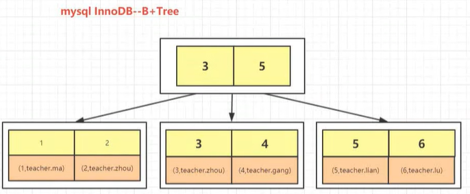
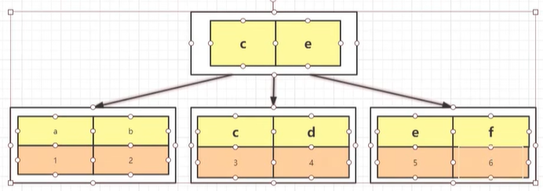
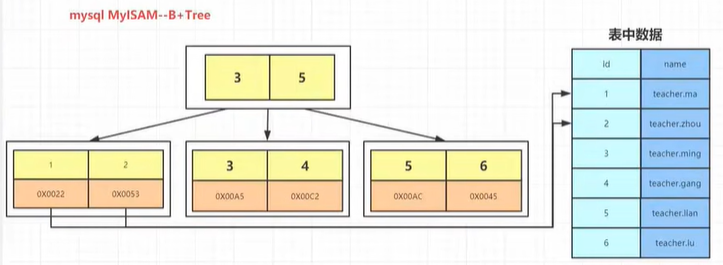

# Mysql

## 索引是什么？

- 索引是帮助Mysql高效获取数据的数据结构
- 索引存储在文件系统中
- 索引的文件存储形式与存储引擎有关
- 索引文件的结构
    - hash
        - 利用hash存储的话需要将所有的数据文件添加到内存中，比较耗费内存空间
        - 如果所有的查询都是等值查询，那么hash确实快，但是在企业或者工作环境中范围查找的数据更多，而不是等值查询，那么hash就不太适合了
    - 二叉树
        - 无论是二叉树还是红黑树，都会因为树的深度过深而造成io次数变多，影响数据读取的效率
    - B树
        - B树所有键值分布在整棵树中，每一个子节点都是一块分页的内存，存储的有子节点的指针，索引，以及对应的数据
        - 当数据过大的时候，每个子节点也就是每页内存存储的数据将很少，这样就会导致树的深度又会加深，会造成io次数变多，影响数据读取的效率
    - B+树
        - B+树是在B树基础上做的一种优化，每个节点可以包含更多的节点，非叶子节点存储key，只有叶子节点存储key和数据，叶子节点两两指针相互连接，顺序查询性能更高

## InnoDB存储索引

- InnoDB是通过B+树结构对主键创建索引，叶子节点中存储记录，如果没有主键，那么会选择唯一键，如果没有唯一键，那么会生成一个6位的row_id来作为主键
- 如果创建的索引是其它字段，那么在叶子节点中存储的是记录的主键，然后再通过主键索引找到对应的记录

## MyISAM存储索引

- myisam存储索引，非叶子节点存储的是一个地址值，根据地址从磁盘中取出数据

## mysql中的索引分类

- 主键索引
    - 主键是一种唯一性索引，它必须指定为Primary key，每个表只能有一个主键
- 唯一索引
    - 索引列的所有值都只能出现一次，即必须唯一，值可以为空
- 普通索引
    - 基本的索引类型，值可以为空，没有唯一性的限制
- 全文索引
    - 全文索引的索引类型为FULLTEXT。全文索引可以在 varchar、char、text类型的列上创建
- 组合索引
    - 多列值组成一个索引，专门用于组合搜索

## mysql的存储引擎

|              | MyISAM     | InnoDB                     |
| ------------ | ---------- | -------------------------- |
| 索引类型     | 非聚簇索引 | 聚簇索引                   |
| 支持事务     | 否         | 是                         |
| 支持表锁     | 是         | 是                         |
| 支持行锁     | 否         | 是                         |
| 支持外键     | 否         | 是                         |
| 支持全文索引 | 是         | 是                         |
| 适合操作类型 | 大量select | 大量insert、delete、update |

## 回表

回表就是从普通索引中查找到主键ID，然后再回到主键索引中通过ID获取到具体的数据值

## 覆盖索引 索引覆盖

当我们的sql只是进行id列的查询时，无需再进行回表即可得到查询结果，这个过程就叫覆盖索引

## 最左匹配原则

在使用组合索引的时候，我们通常在查询sql语句中where条件后便要按照组合索引列的顺序来查找数据，底层B+数是根据组合索引列顺序来创建的非叶子节点，索引我们在写sql的时候要符合最左匹配原则才可以使索引生效，有些特殊情况下，mysql的优化器会生效帮助我们进行sql的优化来使用组合索引。

create idx_a on table (nage,age)   我们给name列和age 创建一个组合索引

select * from table where name = 'zxf'; 会使用索引

select * from table where name = 'zxf' and age = 10; 会使用索引

select * from table where age = 10; 不会使用索引

select * from table where  age = 10 and name = 'zxf'; 因为有mysql优化，也会使用索引

## 索引下推

我们查询 name 和 age 的时候

直接从存储引擎中拉取数据的时候直接按照name和age 做判断，将符合条件的结果返回给mysqlserver

## 优化细节

- 当使用索引列进行查询的时候尽量不要使用表达式，把计算放到业务层而不是数据库层
- 尽量使用主键查询，而不是其它索引，因此主键查询不会触发回表查询
- 使用前缀索引
- 使用索引扫描来排序
- 推荐使用 in 操作符，可以使用索引
- 尽量避免范围列后边等值操作，会造成索引失效
- 强制类型转换会进行全表扫描
- 更新很频繁，数据重复度高的字段不适合建立索引
- 能使用limit 尽量使用limit
- 单表索引尽量控制在5个以内
- 组合索引的列最好控制在5个以内

## mysql ABC联合索引，where B 和 C 索引生效吗 where A 和 B 索引生效吗 where A 和 C 生效吗

- 没有最左元素的前提下，索引不生效，也就是where B 和 C 不生效
- 在使用最左元素的前提下，索引是生效的，where A 和 B 生效，同理 where A 和 C 也生效
