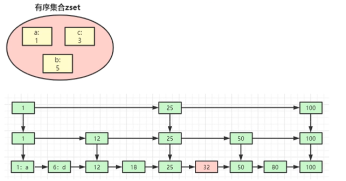
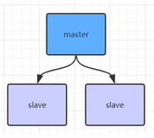
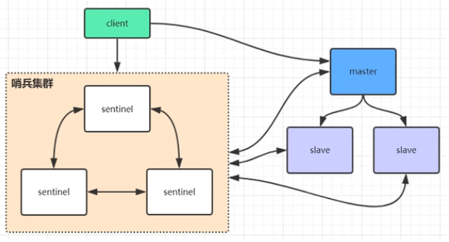
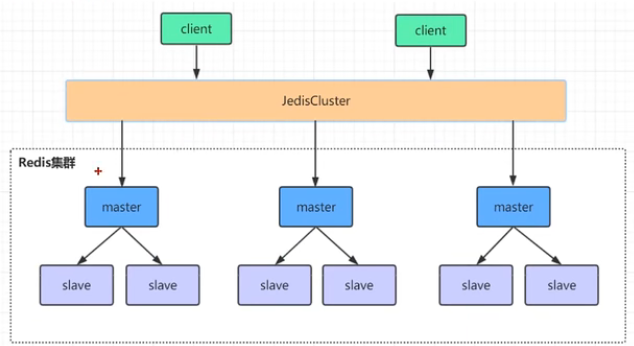

# Redis

## redis是多线程还是单线程的

- redis在6.0之前的单线程是指其网络IO和键值对读写都是一个线程完成的
- 6.0之前只有网络请求模块和数据操作模块是单线程的，而它的持久化、集群数据同步其实是有额外的线程执行的
- redis在6.0之后的多线程是指网络请求过程采用了多线程，而键值对的读写命令仍然是单线程处理的，所以redis依然是并发安全的

## redis单线程为什么还能这么快

- 命令执行是基于内存操作的
- 命令执行时单线程操作，没有线程切换的开销
- 基于IO多路复用机制提升redis的IO利用率
    - 使用epoll机制进行IO多路复用
    - 避免轮询，使用创建注册监听回调的机制来处理多个线程的数据处理
- 高效的数据存储结构：全局hash表以及多种高效的数据结构

## redis为什么不用多线程

- 由于数据放在内存中，而且它的处理逻辑也很简单，即使是单线程，redis也可以支撑大量的处理操作，当qps很大的时候，性能瓶颈不在于cpu而在于带宽，所以没必要为了提高cpu的利用率而是用多线程

## redis底层数据是如何使用跳表来存储的

- 首先要从最基础的数据结构来说，redis存储set的时候是通过单项链表的结构来存储数据，链表增加和删除都是比较快的，但是查找要顺序查找，就比较慢，这个时候，我们可以对链表做些优化，可以每隔一部分数据提出一个元素来当作n级链表的节点，这样我们在查找数据的时候就可以类似于二分查找的方式快速查找到我们需要数据的一个范围，然后再向下沉淀去找到最底层的链表中存储数据的元素。这种数据结构就叫做跳表

## Redis中的key已经过期了，却没有被删除

- 业务导致
    - 当我们给key设置了过期时间之后，我们对key进行修改/覆盖的时候，没有指定过期时间的话，这个key的过期时间会被擦除，就导致key永不过期
- key删除策略
    - 惰性删除：redis中的key过期之后是不会立刻删除的，当你再次去读写这个key的时候，会触发惰性删除，判断key是否过期，过期了就清理掉，但这样会导致大量的冷数据无法释放内存
    - 定时删除：为了解决冷数据的问题，reids会定期（默认100ms）主动淘汰掉**一批**已经过期的key。

## redis中 key 没有设置过期时间，但是却被删除了

- redis可以设置最大可使用内存的参数，当你redis使用内存超过这个值的时候，会主动触发缓存淘汰策略
- 针对设置了过期时间的key处理
    - volatile-ttl：在筛选时，会针对设置了过期时间的键值对，根据过期时间的先后进行删除，越早过期的越先被删除
    - volatile-random：在设置了过期时间的key中，进行随机删除
    - volatile-lru：会使用LRU算法筛选设置了过期时间的键值对进行删除
    - volatile-lfu：会使用LFU算法筛选设置了过期时间的键值对进行删除
- 针对未设置过期时间的key做处理
    - allkeys-random：从所有键值对中随机选择并删除数据
    - allkeys-lru：使用LRU算法在所有数据中进行筛选删除
    - allkeys-lfu：使用LFU算法在所有数据中进行筛选删除
- 不处理：
    - noevication：不会剔除任何数据，拒绝所有写入操作并返回错误，此时reids只响应读操作

## LRU和LFU淘汰算法

- LRU算法：最近最少使用
    - LRU算法根据数据的历史访问记录来进行淘汰处理，核心思想是：如果数据最近被访问过，那么将来被访问的几率也很高，通常是使用双向链表来实现，会占用大量的内存，所以redis使用的是近似LRU的算法，每次访问的时候，给对象记录以下当前的时间戳，当需要删除数据的时候，随机选取5个元素，删除最久未被访问过的
- LFU算法：最不经常使用
    - LFU算法根据key最近使用的频率来进行淘汰，它比LRU更加精确地表示一个key被访问的热度

## redis删除key会阻塞吗

- 首先肯定的是，删除key会造成阻塞，但是要根据实际场景来分析
- 删除 单个string类型，很快
- 删除 单个string类型，但是这个键值对很大，也会造成阻塞
- 删除 列表、集合、有序集合或者hash类型的key，根据复杂度也有可能造成阻塞

## redis的主从、哨兵、高可用集群 架构的对比

- 主从

主从架构，如果从节点会同步主节点的数据，当主节点挂了的时候，可以通过手动或者自动的方式选取一个新的主节点，故障节点恢复之后也会成为新的主节点的从节点。会出现瞬断问题，根据数据量的大小恢复的时间长短也是个问题

- 哨兵

哨兵模式，就是多出来了一个哨兵的集群，客户端访问的时候，通过访问哨兵集群来获得主节点的信息然后访问主节点读写数据

当主节点挂了的时候，哨兵会自动帮忙选举出一个主节点。集群搭建比较复杂。

- 高可用集群

高可用集群就是通过构建多个小的主从架构，形成水平的扩容，来达成一个高可用的集群。数据分片存储，一个节点挂了不会影响到所有的节点数据的读取。

## redis集群数据hash分片算法

- redis Cluster 会将所有数据在逻辑上划分未16384个 slots(槽位)，每个节点负责其中一部分槽位，槽位的信息存储于每个节点中
- 当redis cluster的客户端来连接集群的时候，它也会得到一个集群的槽位配置信息并将其缓存在客户端本地，当客户端要读写某个key的时候会根据 槽位定位算法定位到目标节点
- 槽位定位算法：默认会对key使用crc16算法进行hash得到一个值，然后对16384进行取模运算得到具体的值，再根据槽位的值和redis节点的对应关系就可以定位到key具体落到哪个redis节点上

## redis持久化 AOF、RDB、混合持久化

- RDB：在默认的情况下，redis将内存中的数据以快照的方式保存在dump.rdb的二进制文件中
    - 可以设置生成rdb快照文件的策略
    - bgsave的写时复制（COW）机制：redis在生成快照同时，依然可以正常处理写命令，bgsave子进程由主线程fork生成，共享主线程的内存数据，bgsave子进程运行后，读取内存数据，将他们写入RDB文件中，此时主线程要修改某些数据，这些数据会被复制一份，生成该数据的副本，然后bgsave子进程会将这个副本数据写入到RDB文件，而这个过程中，主线程仍然可以直接修改原来的数据
- AOF：快照功能并不持久，会造成数据的丢失，AOF会将**修改**的每一条指令记录到appendonly.aof文件中(先写入os cache，每隔一段时间fsync到磁盘)
    - 通过配置文件 appenddonly yes 来打开AOF功能
    - 通过配置文件 appendfsync _ 来配置redis多久将数据 fsync到磁盘一次，可以配置写入一条命令就进行一次 或者 每秒进行一次 或者由操作系统决定
    - AOF文件重写：AOF文件中可能有很多无用的指令，所以AOF会定期根据 **内存中的最新数据** 来生成aof文件
        - 通过 auto-aof-rewrite-min-size 64mb 设置aof文件至少达到大小才会自动重写
        - 通过 auto-aof-rewrite-percentage 100 设置自上一次重写之后文件大小增长了100%则再次触发重写  128. 256.....
        - 当然AOF也可以进行手动重写，执行 bgrewriteaof
        - AOF 重写 redis也会fork一个子进程去做，不会对redis正常命令处理有影响
- RBD和AOF 应该选用哪个？
    - 两种策略都可以用，aof数据比较全备，但是恢复的时候速度要慢与 rdb，rdb数据恢复快，但是有丢失的风险
    - 如果既有rdb也有aof，redis启动时会优先选用aof文件进行数据的恢复
- 混合持久化
    - 通过配置 aof-use-rdb-preamble yes 来开启混合持久化，**前提是要开启AOF**
    - AOF重写时，会将重写这一刻之前的内存数据作为RDB快照处理，将快照内容和增量的AOF修改命令一起写入到aof文件，这样redis重启时，会先加载RDB内容，然后再执行AOF增量命令，因此重启效率大幅得到提升

## redis集群为什么至少需要三个master节点

- 因为新的master节点选举是需要大于半数的集群master节点同意才能选举成功
- 如果只有两个master节点，当其中一个挂了，是达不到选举新的master节点条件的

## redis集群支持批量操作命令吗

- 对于mset，mget这样的多个key的原生批量操作命令，redis集群只支持所有key落在同一slot的情况，如果多个key一定要用mset命令再redis集群上操作，可以再key的前面加上{xxx}，这样参数数据分片hash计算的只会是大括号里的值，这样能确保不同的key能落到同一个slot里
- 同样，要在集群中执行lua脚本的时候，需要保证这段脚本内操作的key都要落到同一个solt中，可以通过添加{xxx}的hash tag来保证落在同一个solt中

## redis缓存血崩问题

- 大批量key同时失效，导致缓存都失效
- 在设置过期时间的时候，基于一个基本过期时间再加上一个随机事件来解决，分布过期时间

## redis缓存穿透问题

- 查询db中不存在的数据，不缓存数据的话，会导致并发量大的时候造成db出问题
- 查询db不存在的数据也在redis中缓存一个空的对象
## 缓存数据库数据不一致问题

在多线程的操作下，会出现查询和操作并行的操作，导致读到的缓存和实际数据库中的数据不一致的问题

- 使用redis分布式锁来解决，但是耗费性能，串行执行 强一致性
- 通过读写锁，读锁并行，读锁与写锁之间互斥
- 延时双删机制，在缓存变动的时候，先删除缓存，延时一段时间之后再次删除缓存。

## redis集群模式下分布式锁失效问题

分布式锁，当我们请求一个分布式锁的时候，成功了，但是这时候slave还没有复制我们的锁，masterDown了，我们的应用继续请求锁的时候，会从继任了master的原slave上申请，也会成功。

1. 获取当前系统的时间戳
2. 使用相同的key和随机值在N个结点上请求所，这里获取锁的尝试时间要远远小于锁的超时时间，防止某个masterDown了，我们还在不断获取锁，而被阻塞过长时间
3. 只有在大多数节点上获取到了锁，而且总的获取时间小于锁的超时时间的情况下，认为锁获取成功了
4. 如果锁获取成功了，锁的超时时间就是最初的锁超时时间减去获取锁的总耗时时间
5. 如果锁获取失败了，不管是因为获取成功的结点数没有过半还是因为获取锁的耗时超过了锁释放时间，都要将已经设置了key的master结点上的key删除
