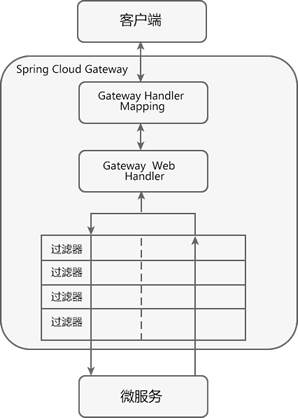

# Gateway

1. DispatcherHandler 路由的总控器，核心在于 handle方法。
2. handle方法会先获取到所有的route对象，通过request匹配到对应的route对象，然后放到request的上下文中
3. 然后会调用invokeHandler方法，把route配置的过滤器和全局的过滤器 然后进行排序，用这些过滤器集合初始化一个过滤器链
4. 通过一系列的过滤器最后走到NettyRoutingFilter的filter方法真正去发起http请求

## 熔断 信号量和线程池

- 信号量
    - 在该模式下，接收请求和执行下游依赖在同一个线程内完成，不存在线程上下文切换所带来的性能开销，所以大部分场景应该选择信号量模式
- 线程池
    - 在该模式下，用户请求会被提交到各自的线程池中执行，把执行每个下游服务的线程分离，从而达到资源隔离的作用。当线程池来不及处理并且请求队列塞满时，新进来的请求将快速失败，可以避免依赖问题扩散。