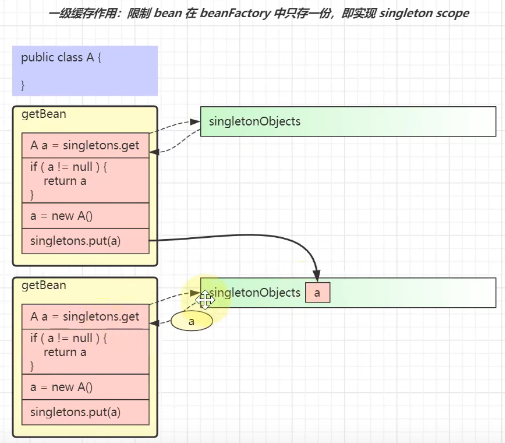
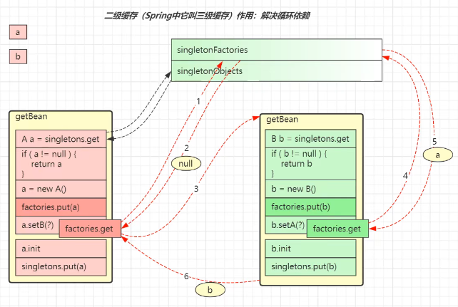
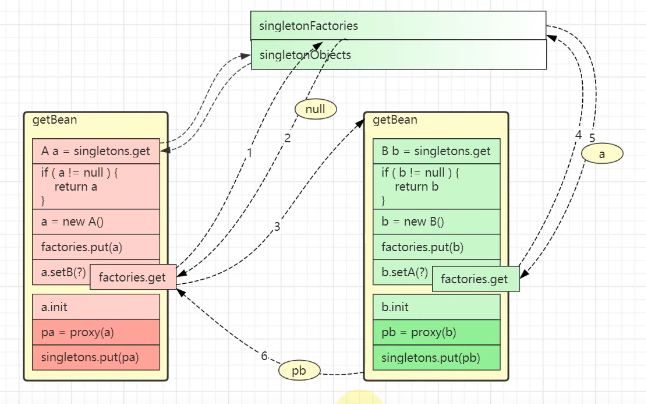
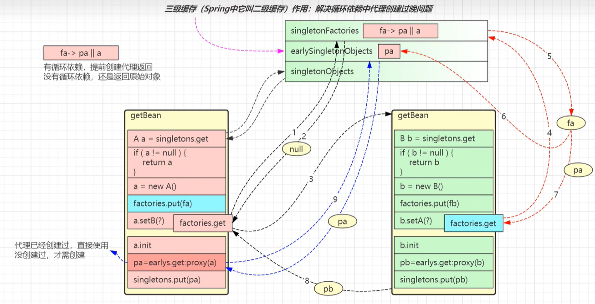

# Spring

## ApplicationContext refresh步骤

1. prepareRefresh - 做好准备工作
    1. 这一步创建和准备了 Environment对象，主要是准备好spring要用到的键值信息
2. obtainFreshBeanFactory - 创建或获取BeanFactory
3. prepareBeanFactory - 准备BeanFactory
    1. 完善BeanFactory
    2. 给各种成员变量赋值，一些类型转换器，内置的beanPostProcessor
4. postProcessBeanFactory - 子类扩展BeanFactory
    1. 这一步空实现，实现的子类可以实现，用到了模板模式，父类定义步骤，子类实现方法
5. invokeBeanFactoryPostProcessors - 后处理器扩展BeanFactory
    1. 这一步可以用来补充或者修改BeanDefinition信息，
    2. ConfigurationClassProcessor - 解析 @Configuration、@Bean、@Import、@PropertySource等注解
6. registerBeanPostProcessors - 准备Bean后处理器
    1. 注册bean后置处理器，可以工作在 bean的实例化、依赖注入、初始化阶段
    2. AutowiredAnnotationBeanPostProcessor 功能有：解析 @Autowired、@Value注解
    3. CommonAnnotationBeanPostProcessor 功能有：解析@Resource、@PostConstruce、@PreDestory注解
    4. AnnotationAwareAspectJAutoProxyCreator功能有：为符合切点的目标 bean自动创建代理
7. initMessageSource - 为 ApplicationContext 提供国际化功能
8. initApplicationEventMulticaster- 为ApplicationContext 提供事件发布器
    1. 用来发布事件的广播器
    2. 从容器中找到applicaitonEventMulticaster的bean作为事件广播器，若没有，也会新建默认的事件广播器
    3. 可以调用ApplicationContext.publishEvent来发布事件
9. onRefresh - 留给子类扩展
    1. springboot在这一步实现了内嵌webserver
10. registerListeners - 为ApplicationContext 准备监听器、
    1. 用来接收事件
    2. 一部分监听器是事先编程添加的，另一部分监听器来自容器中的bean、还有一部分来自@EventListener的解析
    3. 实现ApplicationListener接口，重写其中 onApplicationEvent(E e)方法即可
11. finishBeanFactoryInitialization - 初始化单例Bean，执行Bean后处理器扩展
    1. conversionService也是一套转换机制，作为对PropertyEditor补充
    2. 内嵌值解析器用来解析 @Value中的${}，借用的是Enviroment的功能
    3. 单例池用来缓存所有单例对象、对象的创建都分三个阶段，每一个阶段都有不同的bean后处理器参与进来扩展功能
12. finishRefresh - 准备生命周期管理器，发布ContextRefreshed事件
    1. 用来控制容器内需要生命周期管理的bean
    2. 容器中有名称为lifecycleProcessor的bean就用它，否则创建默认的生命周期容器管理器
    3. 调用context的start，即可触发所有实现LifeCycle接口 bean的start
    4. 调用context的stop，即可触发所有实现LifeCycle接口的bean的stop
## Spring bean的生命周期

1. 处理名称，检查缓存
    1. 先把别名解析为实际名称，再进行后续处理
    2. 若要FactoryBean本身，需要使用 & 名称获取
    3. singletonObjects 是一级缓存，存放单例成品对象
    4. singletonFactories 是三级缓存，存放单例工厂
    5. earlySingletonObjects是二级缓存，存放单例工程成品，可称为提前单例对象
2. 检查父工厂
    1. 优先找子容器的bean，找到了直接返回，找不到继续到父容器找
    2. 父子容器的bean名称可以重复
3. 检查DependsOn
    1. 要显示控制无依赖关系的bean生成顺序，可以使用 A DependsOn B 注解，在B生成之后再生成A
4. 按Scope创建bean
    1. scope 理解为从 xxx范围内找到这个bean更加贴切
    2. 创建singleton 表示从单例池范围内获取 bean，如果没有，则创建并放入单例池
    3. 创建prototype 表示从不缓存bean，每次都创建新的
    4. 创建其它scope  request scope 表示从request对象范围内获取bean，如果没有，则创建并放入request域中
5. 创建bean
    1. 创建bean实例
        1. AutowiredAnnotationBeanPostProcessor 选择构造
        2. 采用默认构造 反射
    2. 依赖注入
        1. AutowriedAnnotationBeanPostProcessor 注解匹配
        2. CommonAnnotationBeanPostProcessor 注解匹配
        3. resolveDependency
        4. AUTOWIRE_BY_NAME 根据名字匹配
        5. AUTOWIRE_BY_TYPE 根据类型匹配
        6. applyPropertyValues 精确指定
    3. 初始化
        1. 内置Aware接口的装配
        2. 扩展Aware接口的装配
        3. @PostConstruce执行
        4. 实现initializingBean接口执行
        5. initMethod
        6. 创建aop代理
    4. 登记可销毁bean
        1. 如果实现了DisposableBean 或 AutoCloseable接口，则为可销毁bean
        2. 如果自定义了destroyMethod，则为可销毁bean
        3. 如果采用了@Bean 没有指定 destroyMethod，则采用自动推断方式获取销毁方法名（close，shutdown）
        4. 如果有 @PreDestroy 标注的方法
        5. singleton scope的可销毁bean会存储在beanFactory的成员当中
6. 类型转换
    1. 如果getBean的 requiredType 参数与实际得到的对象类型不同，会尝试进行类型转换
7. 销毁bean
    1. singleton bean的销毁 在ApplicationContext.close 时，此时会找到所有DisposableBean的名字，逐一销毁
    2. 自定义scope bean的销毁在作用域对象周期结束时
    3. prototype bean的销毁可以通过自己手动调用 AutowireCapableBeanFactory.destroyBean 方法执行销毁
    4. 同一bean中不同形式销毁方法的调用次序
        1. 优先后处理器销毁 即@PreDestroy
        2. 其次 DisposableBean接口销毁
        3. 最后destroyMethod 销毁

## Spring 事物失效的场景及原因

- 抛出检查异常导致事物不能正常回滚

    - 原因：Spring默认指挥回滚非检查异常 RuntimeException、Error
    - 解法：配置 rollbackFor属性为 Exception

- 业务方法内自己 try-catch 异常导致事物不能正确回滚

    - 原因：事物通知只有捉到了目标抛出的异常，才能进行后续的回滚处理，如果目标自己处理掉异常，事物通知无法知悉
    - 解法1：异常原样抛出
    - 解法2：手动设置TransactionStatus.setRollbackOnly()

- aop切面顺序导致事物不能正常回滚

    - 原因：事物切面优先级最低，但如果自定义的切面优先级和他一样，则还是自定义切面在内层，这时若自定义切面没有正确抛出异常
    - 解法：异常原样抛出

- 非public 方法导致的事物失效

    - 原因：SPring为方法创建代理、添加事物通知、前提条件都是该方法是public的
    - 解法：改为public方法

- 父子容器导致事物失效

    - 原因：子容器扫描范围更大，把未加事物配置的service扫描进来
    - 解法1：各扫各的，不要图方便
    - 解法2：不要用父子容器，所有bean放在同一个容器中

- 调用本类方法导致传播行为失效

    - 原因：本类方法调用不经过代理，因此无法增强
    - 解法1：依赖注入自己来调用
    - 解法2：通过AopContext拿到代理对象，来调用
    - 解法3：通过CTW、LTW实现功能增强

- @Transactional方法导致的 synchronized失效

    - 原因：synchronized 保证的仅是目标方法的原子性，环绕目标方法的还有commit等操作，他们并未处于sync块内

    - 解法1：synchronized范围应扩大至代理方法调用

- @Transactional 没有保证原子行为

    - 解法：事务的原子性仅涵盖 insert、update、delete、select ... for update语句，select 方法并不阻塞

## Spring Mvc执行流程

- 初始化阶段
    1. 在Web容器第一次用到 DispatcherServlet的时候，会创建其对象并执行init方法
    2. init方法内会创建 Spring Web容器，并调用容器 refresh 方法
    3. refresh 过程中会创建并初始化 SpringMvc 中的重要组件，例如HandlerMapping，HandleAdapter，HandlerExceptionResolver，ViewResolver等
    4. 容器初始化后，会将上一步初始化好的重要组件，赋值给 DispatcherServlet 的成员变量
- 匹配阶段
    1. 用户发送的请求统一到达前端控制器 DispatcherServlet
    2. DispatcherServlet遍历所有 HandlerMapping，找到与路径匹配的处理器
        1. HandlerMapping有多个，每个HandlerMapping会返回不同的处理器对象，谁先匹配，返回谁的处理器，其中识别@RequestMapping的优先级最高
        2. 对应@RequestMapping的处理器是 HandlerMethod，它包含了控制对象和控制器方法信息
        3. 其中路径与处理器的映射关系在 HadnlerMapping初始化时就会建立好
    3. 将HandlerMethod 连同匹配到的拦截器，生成调用链对象 HandlerExecutionChain返回
    4. 遍历HandlerAdapter处理器适配器，找到能处理HandlerMethod的适配器对象，开始调用
- 执行阶段
    1. 执行拦截器 PreHandle
    2. 由HandlerAdapter调用HandlerMethod
        1. 调用前处理不同类型的参数
        2. 调用后处理不同类型的返回值
    3. 第二步没有异常
        1. 返回ModelAndView
        2. 执行拦截器postHandle方法
        3. 解析视图，得到View对象，进行视图渲染
    4. 第二步有异常，进入HandlerExceptionResolver异常处理流程
    5. 最后都会执行拦截器的 afterCompletion方法
    6. 如果控制器方法标注了 @ResponseBody注解，则在第二步就会生成json结果，并标记ModelAndView已处理，这样就不会执行第三步的视图渲染

## Spring中的注解

- 事物
    - @EnableTransactionManagement：开启声明式事务管理
    - @Transactional：标记需要事务管理的方法或者类
- 核心
    - @Order：标记Bean在spring容器中初始化的顺序，value值越大优先级越小
- 事件、调度
    - @EventListener：监听事件的发生
    - @EnableScheduling：开启定时任务
    - @Scheduled：标记方法为定时任务，配置任务执行的规则
- 切面
    - @EnableAspectJAutoProxy：启动AOP代理
- 组件扫面与配置类
    - @Component、@Controller、@Service、@Respository：标记组件扫描，会被加到Spring容器中
    - @ComponentScan：扫描包下边标记了上边注解的类，加入到容器中
    - @Conditional：条件装配，与组件扫描组合使用，满足条件的才会被加入到容器中
    - @Configuration：标记配置类，常与@Bean注解配合使用
    - @Bean：标记在方法上，表示把返回值加入到容器中，常用作一些复杂Bean的配置生成，**生成的bean名称就是方法名**
    - @Import：导入指定类加入到容器中
    - @Lazy：标记在类上，表示类为懒加载，用到这个类的时候才会去初始化，加在成员变量上，表示先创建代理类解决循环依赖问题，用到时才会去完整实例化这个类
    - @Primary：通过类型匹配注入Bean时，如果多个类型的bean，则优先选择加了此注解的Bean来进行注入
    - @PropertySource：读取外部的kv配置文件加入到env环境中来进行对Bean初始化时的值注入
    - @Autowired：自动注入
    - @Qualifier：通过类型匹配注入时可以指定bean名称来指定注入
    - @Value：值注入

## Spring Mvc注解

- Mapping
    - @RequestMapping：处理请求路径与控制器的映射关系
- Rest
    - @RequestBody：处理请求体
    - @ResponseBody：处理响应体
    - @ResponseStatus：处理状态码
- 参数
    - @RequestHeader：获取请求头里的值
    - @CookieValue：获取Cookie里的值
    - @PathVariable：获取请求路径上的值
    - @RequestParam：获取请求参数的值
- 跨域
    - @CrossOrigin：解决跨域问题，加一些特殊的请求头

## Spring Boot注解

- Properties
    - @EnableConfigurationProperties：开启配置类注入
    - @ConfigurationProperties：标记在类上可以完成成员变量与配置文件中的属性自动注入
- Condition
    - @ConditionalOnClass：标记类路径下包含某个Bean的时候才成立会注入这个bean
    - @ConditionalOnMissingBean：标记缺失某个类的时候，才会注入这个Bean，常用作默认Bean实现的功能
    - @ConditionalOnProperty：标记与配置文件中的某些键值信息一致时，才会注入这个Bean
- Auto
    - @SpringBootApplication：组合注解
    - @SpringBoottConfiguration：标记针对SpringBoot的配置类
    - @EnableAutoConfiguration：自动装配核心注解，注入Bean

## @Configuration注解

- 配置类其实相当于一个工厂，标注了@Bean注解的方法相当于工厂方法
- @Bean 不支持方法重载，如果由多个重载方法，仅有一个能入选为工厂方法
- @Configuration 默认会为标注的类生成代理，其目的是保证@Bean方法相互调用时，仍然能保证其单例特性

## @Import注解

- 可以引入单个Bean
- 引入一个配置类，配置类下边的@Bean都会被加入到容器中
- 通过实现Selector接口，返回一个类名数组，可以引入多个类
- 通过实现ImportBeanDefinitionRegistrar接口，可以自定义BeanDefiniton来实例化Bean
- 通过实现DeferredImportSelector接口，返回一个类名数组，可以引入多个类，先加载当前配置类的@Bean，后续再加载@Import进来的配置类即@Bean

## Springboot自动配置

- @SpringbootConfiguration：主配置类，全局只能有一个标记了这个注解的配置类
- @ComponentScan：主要做组件扫描，里边配置了一些过滤器，过滤掉符合规则的类，不让进行注入，这里排除了springboot自身的所有自动配置类
- @EnableAutoConfiguration：组合注解
    - @AutoConfigurationPackage：用来记住扫描的起始包
    - **@Import(AutoConfigurationImportSelector.class)**：解耦合，加载主从配置类，用来加载 META-INF/spring.factories中的自动配置类，优先级最低

## Spring中的设计模式

1. 单例模式：spring容器中的bean 并不是单例模式
2. 建造器模式：灵活构建对象，链式生成完全品对象
3. 工厂模式：隐藏实现细节，通过方法来获取成品
4. 适配器模式：统一接口，各自实现各自调用
5. 组合模式：把分散的调用统一起来，通过具体实现委托到实现类再调用
6. 装饰器模式：增强对象的功能
7. 代理模式：创建代理对象，对目标进行访问控制
8. 责任链模式：把调用按顺序排成顺序，按照顺序去执行实现
9. 观察者模式：解耦调用关系，一个发布一个监听
10. 策略模式：在处理的时候通过不同策略来执行不同动作
11. 模板模式：父类定义框架，无法实现的流程留给子类去实现

## Spring循环依赖

### 代理

**名词**

- aspect：一个切面类
- advice：通知
- pointcut：切点  一个切面类由 通知 + 切点构成
- advisor：spring中更细粒度的 针对一个方法的切面
- proxyFactory：代理工厂，生产代理对象的，代理对象里有 advisors，存储了被代理对象的切面列表

**注解**

- @Aspect：声明一个代理切面类
- @Around：生成一个环绕通知
- @Before：生成前置通知
- @After：生成后置通知
- 在spring中所有的通知都是环绕的，只不过是通过切点去具体实现为更细粒度的通知类型

最基本的切面是 Advisor，一个Aspect 切面对应 一到多个 Advisor

最基本的 Advice 是 MethodInterceptor，其它 Advice 最终都将适配为 MethodInterceptor

**创建代理的方式**

- 实现了用户自定义接口，采用 jdk 动态代理
- 没有实现用户自定义接口，采用cglib代理
- 设置了 setProxyTargetClass（true） 统一采用 cglib代理

切面、切点、通知不会被代理

**自动代理后处理器 AnnotationAwareAspectJAutoProxyCreator**

调用时机：创建阶段、依赖注入阶段、初始化阶段

### **一级缓存**

一级缓存就是单例池，存放的是成品的单例对象，创建Bean的时候先去单例池找，找不到就创建然后放进去

### 二级缓存(对应spring 的三级缓存)

**背景：** 因为一级缓存不能满足循环依赖的场景，当 A 依赖 B 创建对象的时候，B 同时依赖 A，这样的话，在创建A的时候去单例池找不到 B，就会去创建B，创建B的时候 找不到 A 就会继续创建 A ... 就这样会循环创建。

**如何解决的**

1. 创建 A 对象，放入半成品的 A 对象到 二级缓存中
2. 在 注入 B时，先去一级缓存中找，找不到，去二级缓存中找，找不到，去创建 B
3. 创建 B 对象时，先把 半成品的 B 对象 放到 二级缓存中，
4. 在 注入 A 时，先去一级缓存中找，找不到，去二级缓存中找，找到了半成品 A ，就把半成品 A 注入到 B对象的 set方法里
5. 然后完成 B 的初始化，然后把二级缓存中的 B 清理掉，放到单例池中 ，返回给 A 对象
6. A 对象获取到 B 对象，然后完成 初始化，把 二级缓存中的 A 清理掉，放到 单例池中
7. 完成 循环依赖的注入

**有什么问题？**

spring中如果 对象被代理了，会在初始化的最后步骤创建一个代理对象放入到单例池中。这个时候 用 二级缓存就会出现问题

1.  初始化 A ，放入半成品到 二级缓存，获取 B ，一级缓存中没找到，去二级找，二级没找到，创建B
2. 初始化 B ，放入扮半成品到 二级缓存，获取 A ，从二级缓存中找到了  半成品 A , 注入到 set方法中，
3. 完成 B的 初始化，创建代理对象放入到 单例池中，清理掉 二级缓存的 B，返回给 A 对象
4. A 拿到 B 的代理对象，注入到 set 方法中，完成初始化，创建出代理对象放入到 单例池中。完成循环依赖注入
5. 这个时候，A 对象 完成初始化，并且注入的 B 对象是代理对象，但是 **B 对象完成初始化之后 注入的对象是 未被代理的 A 对象**

### 三级缓存(对应spring 的二级缓存)

如何来解决 代理对象的 循环依赖？

**代理工厂**：作用是根据工厂来返回 代理对象 或者 未被代理对象

1. 初始化 A ，把 A 的代理工厂放入到二级缓存中，然后从单例池获取 B... 从二级缓存获取 B ... 未果之后就创建B
2. 初始化 B ，把 B 的代理工厂放入到二级缓存中，在获取 A 的时候，从单例池获取A未果，从二级缓存获取A，拿到了A的代理对象
3. 通过 A 的代理对象，判断 A 有循环依赖，提前创建了代理对象并返回，
4. B 拿到 A 的代理对象注入到set方法中，完成初始化，创建代理对象，放入到 单例池中，返回给 A
5. A 拿到 B 之后，注入到set方法中，完成初始化，创建代理对象，放入到 单例池中，至此代理对象循环依赖实例化完毕

### 构造方法解决循环依赖

当循环依赖发生在构造方法上的时候，三级缓存就无法解决这个问题了，因为实例创建就会卡在循环之上

- @Lazy：延迟目标对象的创建，在构造注入的时候，创建一个代理对象去填充，让初始化流程得以跑通，在真正使用对象的时候 使用的是代理对象
- @Scope：也是生成代理类来解决循环依赖
- ObjectFactory 或 ObjectProvider：通过对象工厂的方式来填充目标对象，在真正使用的时候，通过工厂来获取到真正的目标对象
- Provider：java实现的对象工厂

**总结**

- 一级缓存存放成品对象
- 二级缓存存放 发生了循环依赖时的产品对象(有可能是原始bean，也有可能是代理的bean)
- 三级缓存存放对象工厂，发生循环依赖时，会调用工厂获取产品
- Spring期望在初始化时创建代理，但如果发生了循环依赖，会由工厂提前创建代理，后续初始化时就不必重复创建代理
- 二级缓存的意义在于，如果提前创建了代理对象，在最后的阶段需要从二级缓存中获取此代理对象，作为最总结果